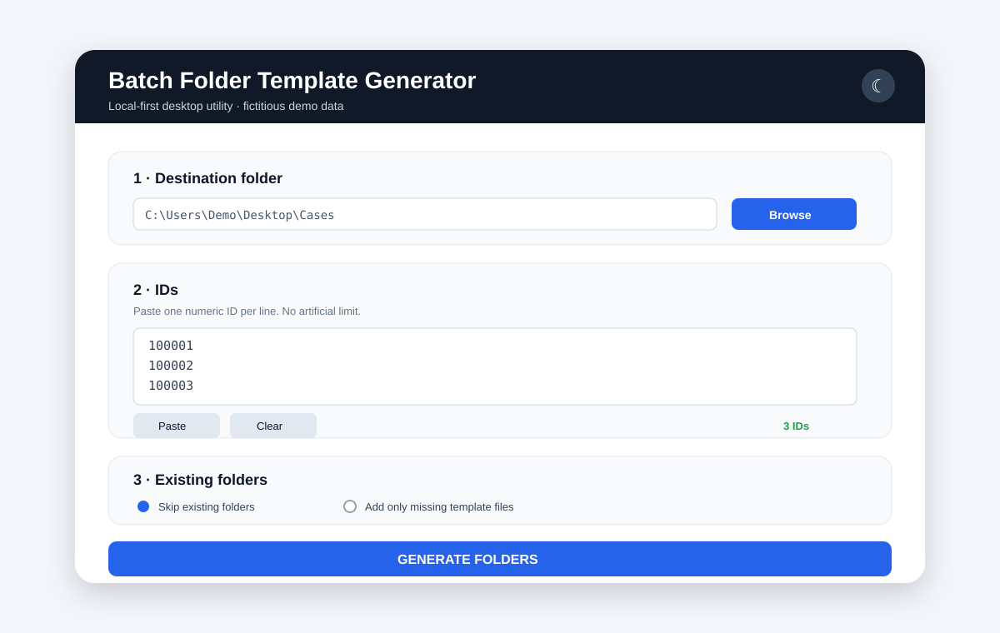

# Batch Folder Template Generator


A small **local-first Windows desktop utility** for generating many folders from a pasted list of numeric IDs and copying the same set of reusable local template files into each folder.

The public repository intentionally contains **no real administrative documents, personal data, credentials, production paths or organization-specific templates**.

<p align="center">
  
</p>

> The screenshot above uses fictitious data only.

## What it solves

When the same folder structure and documents must be prepared repeatedly, manual creation is slow and error-prone. This tool turns a list of numeric IDs into a consistent batch workflow:

1. paste one ID per line;
2. select the destination folder;
3. choose how existing folders should be handled;
4. generate all folders and copy the local templates automatically.

## Features

- **Batch processing** with no artificial application limit on pasted IDs.
- **Strict input validation** using a configurable regular expression.
- **Duplicate detection** before processing.
- **Local template folder**: production documents never need to be stored in Git.
- **Safe existing-folder modes**: skip folders or add only missing files.
- **Transactional creation** for new folders using a temporary working directory.
- **Scrollable desktop UI** built with CustomTkinter.
- **Light/dark mode**.
- **Local-only execution**: no telemetry, cloud dependency or network calls.

## Architecture

```text
User input
   │
   ▼
Validation + deduplication
   │
   ▼
Destination / existing-folder policy
   │
   ▼
Local template discovery
   │
   ▼
Temporary working directory
   │
   ▼
Atomic folder creation / safe merge
```

The application deliberately keeps configuration, templates and generated data outside the public source repository.

## Privacy by design

This repository publishes only the reusable software pattern. It does **not** publish the production workflow or its confidential content.

- No real case or expediente identifiers.
- No names, DNI/NIE, addresses or personal data.
- No internal administrative resolutions or reports.
- No signed documents.
- No production templates.
- No production `.exe` containing private templates.
- No credentials, tokens or API keys.

Actual production templates must remain outside Git and are explicitly excluded by `.gitignore`.

> **Important:** PyInstaller packaging is not encryption. Files embedded in an executable can be recovered, so an `.exe` containing confidential templates must be treated as confidential too.

See [SECURITY.md](SECURITY.md) for the full publication policy.

## Quick start

### 1. Install dependencies

```bash
pip install -r requirements.txt
```

Python 3.11+ is recommended.

### 2. Create your local configuration

Copy:

```text
config.example.json
```

to:

```text
config.json
```

and adapt the folder naming rule if required.

### 3. Add your local templates

Create a folder named:

```text
templates/
```

Place only files you are authorized to use inside it. The entire directory is ignored by Git.

### 4. Run

```bash
python app.py
```

## Windows build

Run:

```bat
build_windows.bat
```

The resulting executable is generated under `dist/`.

For a public build, use dummy or public templates only. Never publish a production executable that embeds confidential documents.

## Configuration

`config.example.json` controls the generic naming behavior:

```json
{
  "app_name": "Batch Folder Template Generator",
  "app_subtitle": "Local desktop utility for batch folder creation",
  "folder_prefix": "Case ",
  "folder_suffix": "",
  "id_pattern": "^\\d+$"
}
```

For example, ID `100001` with the default settings creates:

```text
Case 100001/
```

## Repository structure

```text
app.py                         # Desktop application
config.example.json            # Public-safe configuration example
requirements.txt               # Python dependency
build_windows.bat              # Windows/PyInstaller build helper
docs/demo.svg                  # Fictitious UI preview
templates.example/README.txt   # Safe placeholder only
SECURITY.md                    # Privacy and publication rules
.gitignore                     # Prevents production material being committed
LICENSE                        # MIT License
```

## Security model

The project assumes two physically separate workspaces:

```text
PUBLIC REPOSITORY
├─ generic source code
├─ dummy examples
└─ documentation

PRIVATE PRODUCTION WORKSPACE
├─ real templates
├─ local configuration
├─ generated folders
└─ production executable
```

This separation is intentional: confidential material should **never enter Git history**, even temporarily.

## License

MIT License. See [LICENSE](LICENSE).
